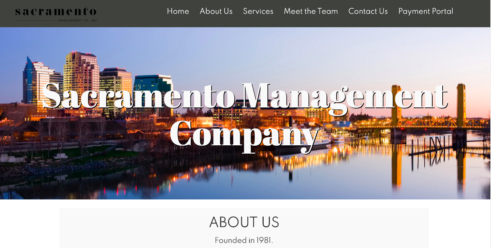

[![Contributors][contributors-shield]][contributors-url]
[![Issues][issues-shield]][issues-url]
[![MIT License][license-shield]][license-url]

 

  

  <h3 align="center">Sacramento Management Company Responsive Website</h3>

  

     
    <a href="https://github.com/zcorpuz/SacMgmt"><strong>Explore the docs »</strong></a>
     
     
    <a href="https://sac-mgmt.herokuapp.com/">View Demo</a>
    ·
    <a href="https://github.com/zcorpuz/SacMgmt/issues">Report Bug</a>
  

  
<h2 style="display: inline-block">Table of Contents</h2>

  <ol>
    <li>
      <a href="#about-the-project">About The Project</a>
      <ul>
        <li><a href="#built-with">Demo</a></li>
      </ul>
      <ul>
        <li><a href="#built-with">Landing Page</a></li>
      </ul>
      <ul>
        <li><a href="#built-with">Built With</a></li>
      </ul>
    </li>
    <li><a href="#contributing">Roadmap/To-do</a></li>
    <li><a href="#license">License</a></li>
    <li><a href="#contact">Team</a></li>
    <li><a href="#contact">Acknowledgements</a></li>
  </ol>

## About the Project
This website is developed for our client, Sacramento Management Company, based in Sacramento, CA. We were asked to develop a website that is modern but easy to the eye, as they were looking to expand their clientele to younger homeowners while also retaining their current third-age customers. They had another website that they want to discontinue because the design was outdated and non-user-friendly. Thus, this website is reflective of the client's needs and goals. 

This application is built as one page, where if you scroll down, you will see all the sections pertaining to the housing company. You can also access each section with the navigation bar, in case you do not have time to scroll through the whole page. 

This application is responsive, where no matter what the screen size is (or device used), the application would still be presentable to the user. 

The reason we chose to partner with this client is because they were interested in increasing their online presence, especially during the COVID-19 pandemic. Since they had a previous outdated website, they were looking to modernize their brand so that they appeal to all new homeowners. They were also interested in establishing a platform where they would connect to their clientele virtually. 

### Demo
This is the demo of the website: https://sac-mgmt.herokuapp.com/.

### Landing Page
This is how the site will look like when:

* opened on a desktop:
 

### Built With 
* [React](https://reactjs.org/)
* [Node.js](https://nodejs.org/en/)
* [Express.js](https://expressjs.com/)
* [MongoDB](mongodb.com) 

## Roadmap / Todo
* See the [open issues](https://github.com/zcorpuz/SacMgmt/issues) for a list of proposed features (and known issues).

## License
Distributed under the MIT License. See `LICENSE.md` for more information.

## Team
This website was done with a collaborative effort from Carolina Aldana, Cattleya Pia, Maira Garcia, and Zach Corpuz.

## Acknowledgements
* [Leaflet API](https://leafletjs.com/reference-1.7.1.html) 
* [styled-components](https://styled-components.com/) 
* [Bootstrap](https://getbootstrap.com/docs/5.0/getting-started/introduction/) 

[contributors-shield]: https://img.shields.io/github/contributors/zcorpuz/SacMgmt.svg?style=for-the-badge
[contributors-url]: https://github.com/zcorpuz/SacMgmt/graphs/contributors
[issues-shield]: https://img.shields.io/github/issues/zcorpuz/SacMgmt.svg?style=for-the-badge
[issues-url]: https://github.com/zcorpuz/SacMgmt/issues
[license-shield]: https://img.shields.io/github/license/zcorpuz/SacMgmt.svg?style=for-the-badge
[license-url]: https://github.com/zcorpuz/SacMgmt/master/LICENSE.md
